## Week 1:
Q-learning
- Q-learning implementation for gym environment ```Mountain Car Discrete```
- Epsilon Greedy exploration strategy with epsilon decay rate of ```2/episodes``` and floor of epsilon = 0
- Update Q-table values with:
$Q(state,action) = (1 - \alpha)Q(state,action) + \alpha(reward+\gamma argmax_\theta(Q(state,\theta) - Q(state,action)))$
- To handle continuous state environment, organize into buckets for the Q-table to have finite size
- Validation environment runs every 10 runs taking average of 5 attempts with agent taking only deterministic actions
-  Training losses:\
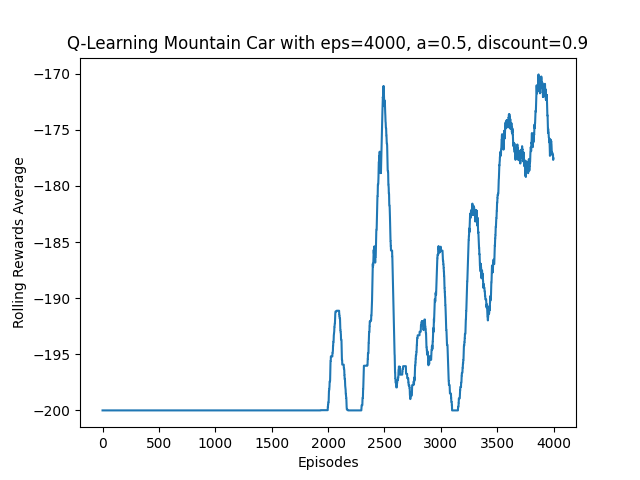
- Validation runs tuple list is exported in ```.pkl``` format for use in comparison scripts
## Week 2:
SAC-Discrete
- SAC discrete implentation for same gym environment ```Mountain Car Discrete```
- Utilizes double Q-networks for critic, Agent network, and Target networks
- Update Critic networks with loss function:
$Loss_C = MSE\_loss(Q1, Q\_target1)+MSE\_loss(Q2,Q\_target2)$
- Update Actor network with loss function:
$Q_1, Q_2 = q\_critic(s)$
$Loss\_a = \sum ( \text{probs} \cdot (\alpha \cdot log\_probs - \min (Q_1,Q2)))$

- Update target Q-networks with polyak averaging:
$\theta_{t+1} = \alpha_{t}\theta_{t}\ + (1-\alpha_{t})\theta_{t}$

Comparison with Q-learning
- Utilize matplotlib script to show comparison between two pickled validation episodes of both Q-learning and SAC-Discrete\
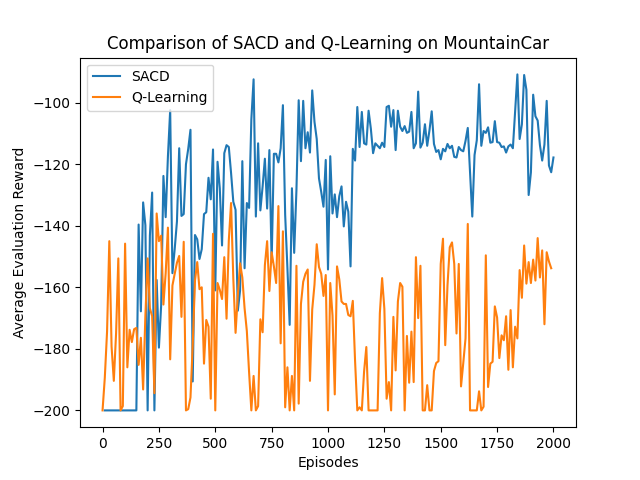

- MountainCarContinuous is an extremely difficult environment for most AC algorithms since it's reward sparse and requires extreme exploration to gain any positive rewards since it normally only comes after solving the environment. In this implementation, I take a few measures to mitigate this challenge:
    - Dedication non-deterministic episodes: By taking a few episodes composed of only non-deterministic episodes, we're able to significantly increase probability of reaching a positive reward state for the Algorithm to begin convergence towards
    - Custom Rewards Algorithm: Based on observations of validation episodes and failiures, I impleneted a custom reward function to guide the actor towards a positive state.
        - Reward for moving towards goal, offset by starting position in the episode since that is variable
        - Reward for reaching high velocity, since the main challenge of this episode is based on increasing momentum as the car does not have usfficent power to reach the top of the hill on it's own power
        - Reward for reaching the end, since in the base reward function, there is no positive reward at the end, it can make it difficult for the algorithm to identify that as an advantageous state, thus adding a large reward for solving the episode.
        - Penalty for staying still, human observation showed that the model struggled with oscillations and staying still, adding a penalty for staying withing 1e-4 of previous position encourages more movement from the agent.

    Overfitting Analysis given training-validation loss scenarios:
    - Training loss best, Validation Loss best:
        - Given this scenario, it means that generally, we have good generality between both training and validation datasets. This all must be confirmed by final test dataset which the model has never seen to ensure that model isn't overfitting to both Training and Validation datasets.\
        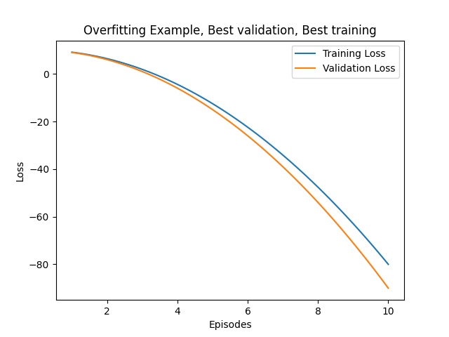
    - Training loss best, Validation Loss worst:
        - If training loss is a best-case scenario while validation losses are terrible, that is an indication that the model has overfit to the training dataset and has lost generalization.\
        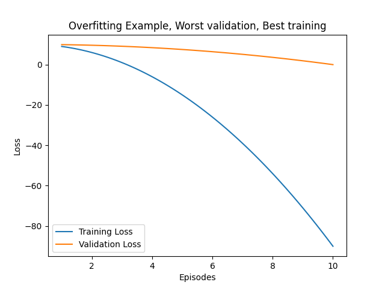
    - Training loss worst, Validation Loss best:
        - This means that the model has overfit towards the Validation dataset, or that there is data leakage from Validation set which has made us lose generalization.\
        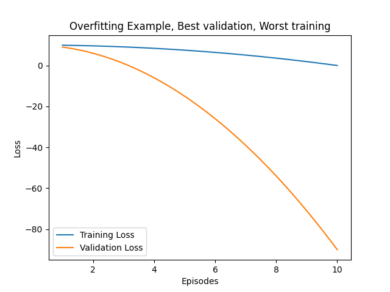

    Given this information and the graph at the top of the section supposing that the Q-learning graph is validation and SACD is training, it would be optimal to stop training at 500-600 episodes as at that point the validation rewards begin to decrease and training loss continues to improve, incdicating the start of overfitting.

    
## Week 3
SAC
- Implemented Continous version of SAC algorithm based on my Discrete implementation
    - Changed output layer of Policy network to output log standard deviation and mean of a normal distribution. Sampling changed accordingly.
    - Critic networks also accept state and action since actions are now a continuous value.
- In the validation, curve due to very different reward structure, it goes from 0 to 100 very quickly as there is a small penalty for taking additional moves but a +100 reward for reaching the end which was not in the Discrete model.\
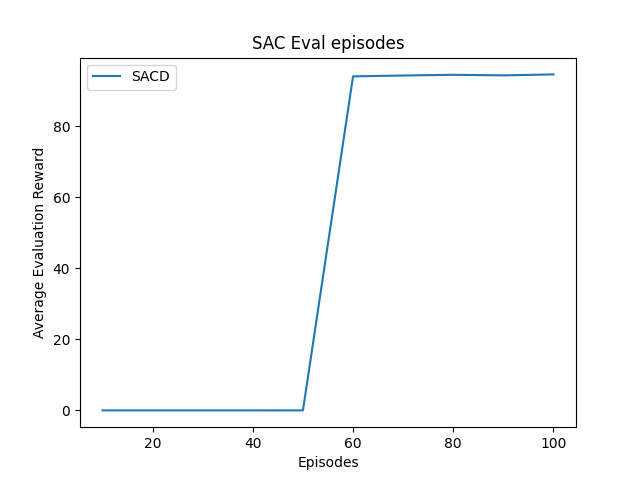

Hyperparameter tuning methods:
- Ultimately the goal is to make the optimal adjustments during training to have the best hyperparameters during training for convergence at that moment.
  - Methods such as grid search and total random search, although exhaustive are very computationally expensive which is not ideal for our use case.
  - Evolutionary methods such as Successive halving are much more optimal in scenarios where we want to preserve computational resources\
        1) Begin with all reasonable hyperparameters with very limited resources\
        2) Pick first half of best-performing combinations\
        3) Repeat with best performing half recieving double the resources until convergence

PPO:
- On-policy method that uses methods to limit large policy updates
- Actor loss defined by: $L^{CPI}(\theta) = \hat{E}_t[min(r_t(\theta)\hat{A}_t,clip(r_t(\theta),1-\epsilon,1+epsilon)\hat{A}_t)] $
    - Serves as a lower bound for the loss
    - By minimizing loss, you can minizie large updates to the Policy, increasing training stability
- Critic loss = MSE between predicted reward and actual reward
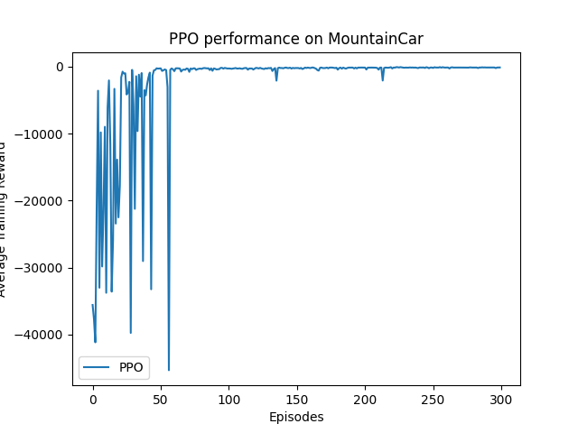


## Week 4

Benchmark Comparison Between SACD and PPO
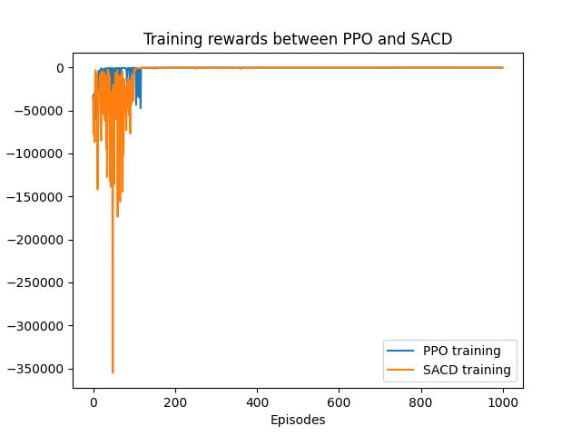
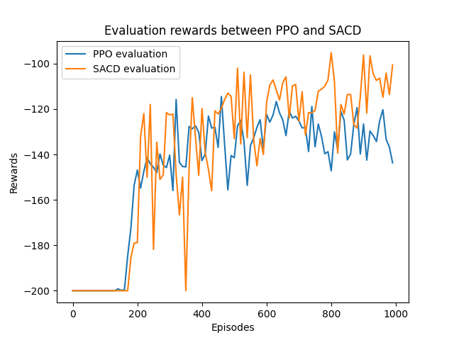
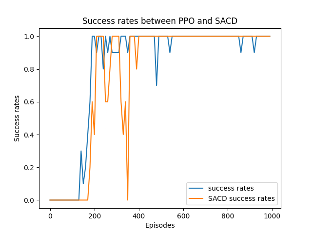

- Overall, SACD converged faster in training, converged to a better reward in evaluation and reached 100% completion in a similar episode count. However, PPO was much more stable in training. This is due to the inherent designs, by using a clipped objective function, PPO guarantees stability by reducing the magnitude of policy updates, however SAC uses entropy regularization and off-policy learning which means that it can have better exploration,and can be more sample efficent by reusing past experience from different actor policies.

RLHF applications
- Train a neural network based on human preference
    - Human feedback highly subjective, and needs bias standardization
    - On a scale of 1-5, humans don't follow a normal dist with mean at 2.5, thus we should standardize with multiple methods
    - NN to train on human feeback can shape a reward function

- Highway Env
    - All observations come in 2d arrays, which aren't compatible with traditional nn architectures, as a simple solution, you can flatten out the 2d array into a 1d array
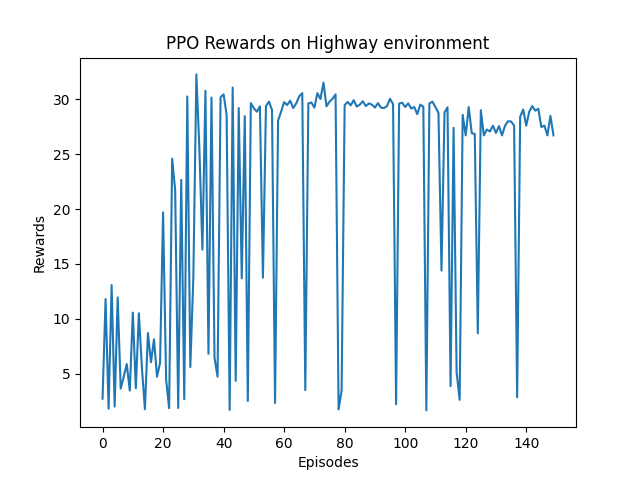
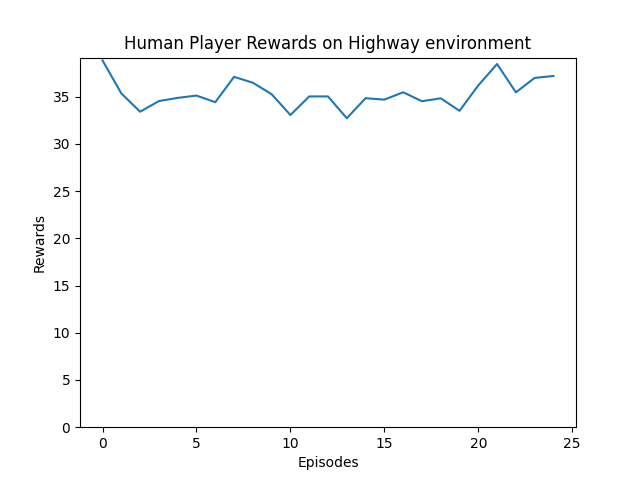
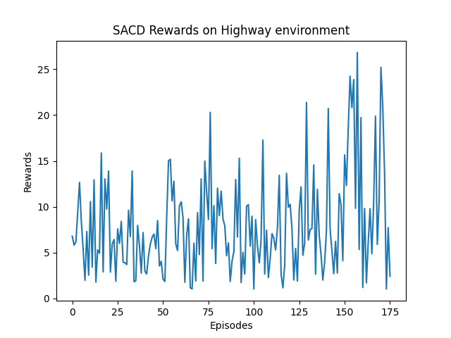
    - Due to lack of ability to permutate objects in experiences that similarly to humans, and possibly due to the reward function, the PPO algorithm never reaches base scores reached by a human and crashes significantly more often.
    - SACD performs even worse than PPO due to it's lower stability in training leading to it being unable to reliably maximize rewards, despite consitently avoiding collisions(one of the main goals of the environment)
    - Plan: train based ~100 user episoes (about 4000 steps)
        - Begin with a simple linear nn as reward model based on flattened proximity matrix of vehicles
        - Train network to identify predicted user action for a state,
            - reward = 1 if predicted user action from previous state
            - reward = -1 if not taken predicted user action from previous state
            - Esentially assuming 
        - the transition to a more complex CNN reward model based on greyscale image of environment.

- Image classification
    - To accurately model human sight -> reward model we can use CNN on Greyscale image